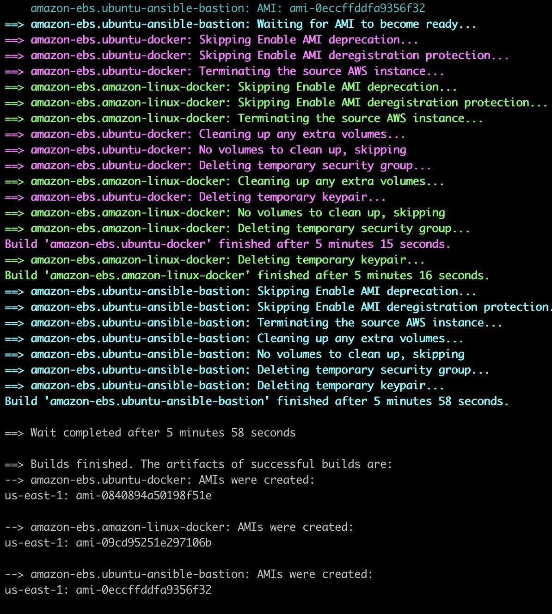
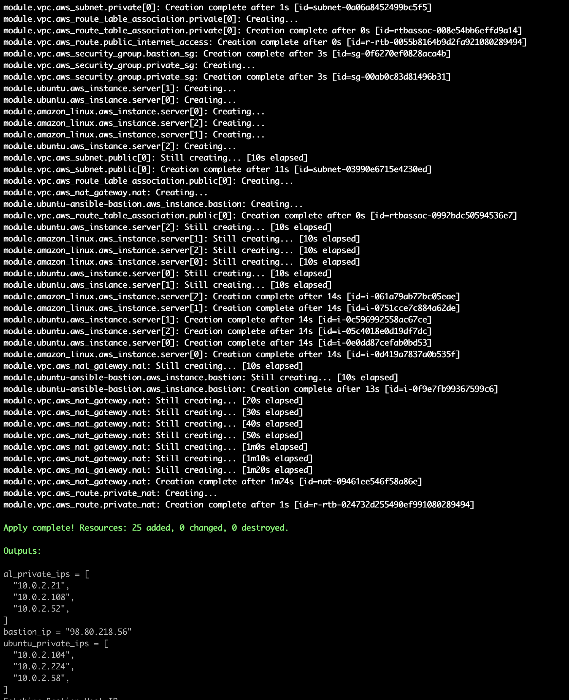
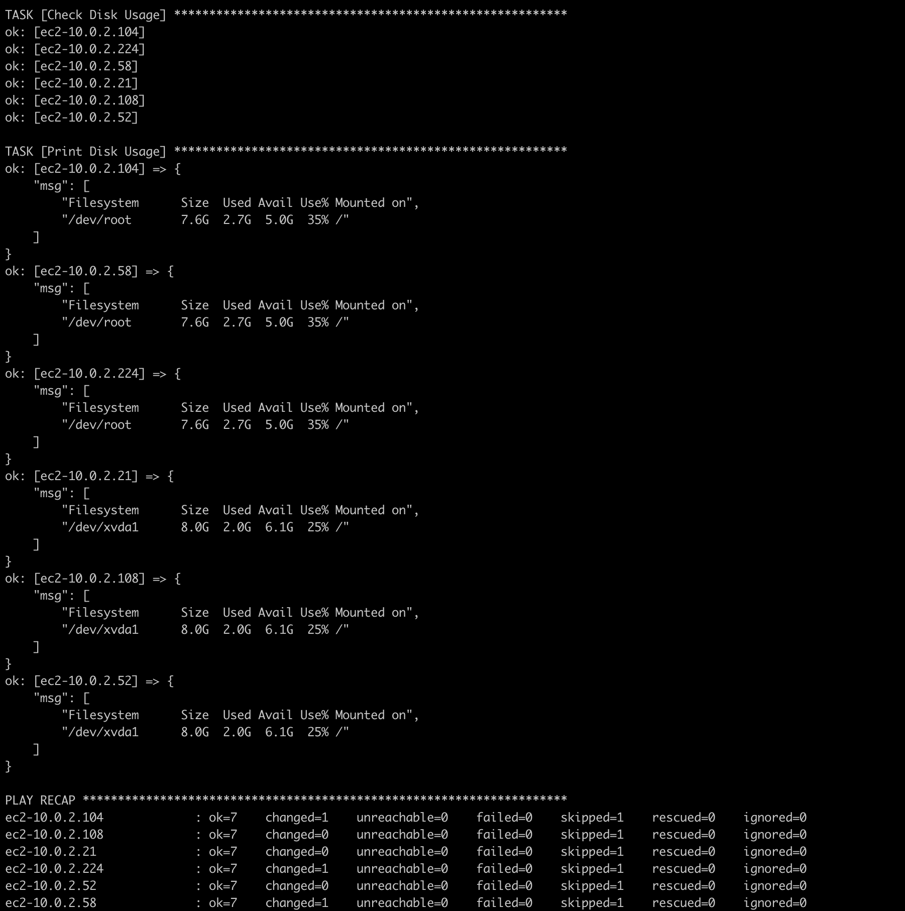
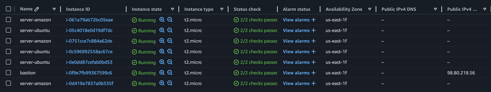

# Packer + Terraform Intro

1. Create a key-pair in aws, say key1. Download the key-pair.

    We will be using 2 keys for security reasons. 

2. Run the script

    ```bash
    chmod +x deploy.sh
    ./deploy.sh -key=~/.ssh/key1.pem # replace with the appropriate key path
    ```

    We should see an output like this:
    
    
    
    

3. SSH into servers

    ```bash
    ssh -i ~/.ssh/key1.pem ubuntu@<bastion-ip>

    ssh -i ~/.ssh/bastion_key.pem <user>@<ec2-ip>
    ```

4. Destroy

    ```bash
    cd terraform
    terraform destroy
    ```
